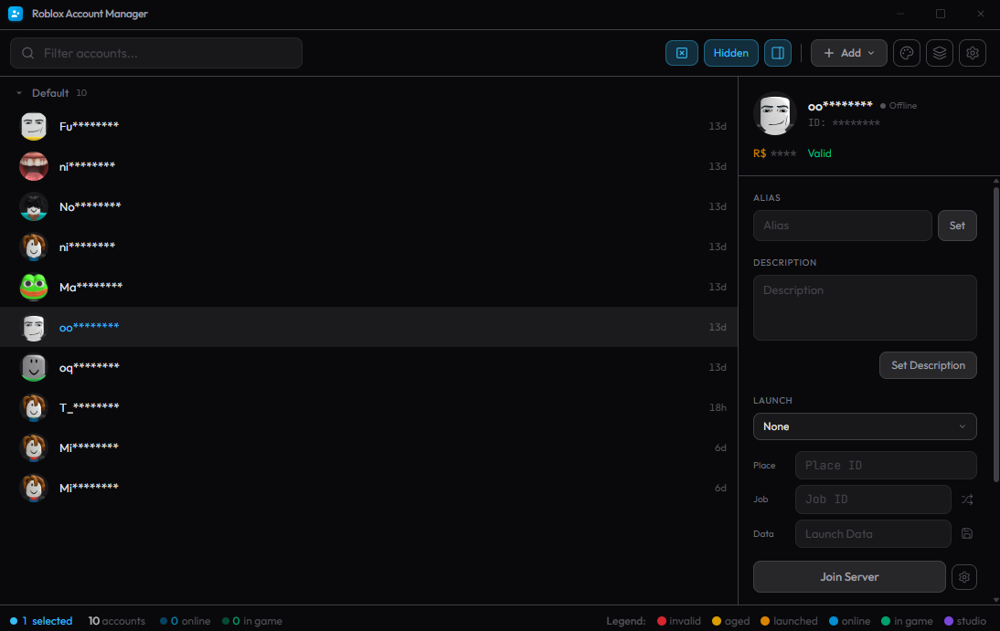

Full credit to [ic3w0lf22](https://github.com/ic3w0lf22) for the original Roblox Account Manager. I am just continuing the project where I think optimizations or additions could be made.

# Roblox Account Manager

**[Download Latest v4 Pre-release](https://github.com/niccsprojects/Roblox-Account-Manager/releases?q=beta)**

Release download counts are based on GitHub release asset downloads across tags and are not unique installs.

Application that allows you to add multiple accounts into one application allowing you to easily play on alt accounts without having to change accounts

Useful for games that require grinding off other players, or storage accounts that hold in game items or currency, or just to have multiple accounts that you can easily find and use.

You are welcome to edit the code and create pull requests if it'll benefit this project.

Multiple Roblox Instances and Botting Mode are built into the account manager but [must be manually enabled](https://github.com/niccsprojects/Roblox-Account-Manager/blob/master/README.md#q-how-do-i-enable-multi-roblox).

Report bugs to the issues section or direct message me via discord @niccdev. The discord (https://discord.gg/MsEH7smXY8) is ic3w0lf22's but is no longer actively maintained.

# WARNING
If someone asks you to generate an "rbx-player link", **DO NOT** do it, they can use these to join any game using your account, or even launch roblox studio with one of your games. They can do many things in game such as spend your robux or even do things that can get your account terminated. **USE THESE FEATURES AT YOUR OWN RISK**

# RAM v4 (Beta)
Roblox Account Manager v4 is in active beta on a new Rust + TypeScript stack using [Tauri](https://tauri.app/).

This branch is under heavy development.

If you need maximum stability right now, use the latest legacy release until v4 exits beta.

## Beta Warning
- Expect bugs and incomplete behavior in some areas
- Some flows may change between beta versions without full backwards-compatibility

## Localization (Crowdin)
v4 now supports localization with Crowdin and `react-i18next`.

I would appreciate contributions to the project through crowdin translations into your mother languages.

# Extra Features
Extra features can be enabled by setting DevMode=false to DevMode=true in RAMSettings.ini
Beware of the risks that you are taking if you accidentally send something to someone.

If you ever want a friend to join a game using your account, make sure you have the PlaceId and JobId correctly entered, then right click an account, and click "Copy rbx-player link", DO NOT do this if someone asks you for it.

# Download
Download Roblox Account Manager from [Releases](https://github.com/niccsprojects/Roblox-Account-Manager/releases).

For v4, use the latest Windows release asset (installer or portable build), then run it.
There are two Windows asset options:
- Recommended assets use filenames without `_full-nexus-ws`
- Full-feature assets use filenames ending in `_full-nexus-ws.exe` or `_full-nexus-ws.msi`
No .NET Framework or VC++ manual install steps are required for v4 in normal cases.

If Windows SmartScreen or antivirus warns, only run builds from the official releases page and verify the publisher/release tag first.

# Developer API
To view the documentation, [click here](https://ic3w0lf22.gitbook.io/roblox-account-manager/).
Change the webserver port if you are planning on using any dangerous functions!
Be careful executing random scripts when having dangerous settings enabled.

# Frequently Asked Questions
## **Q:** Why is this program detected as a virus?

**A:** Some antivirus engines may flag tools like this as suspicious (false positives), especially because RAM can automate browser/game launch flows, manage multiple processes, and expose optional local API/WebSocket controls.

v4 is built on Rust + Tauri and the source is public, so behavior can be audited and reproduced by building from source.

Only download from the official GitHub releases page, and avoid re-uploaded binaries from third-party sites.

## **Q:** How do I enable multi-roblox?

**A:** Open the settings menu by clicking the gear/cog icon in the top right, in the `General` tab, you will see a checkbox for `Multi Roblox`, make sure you have Roblox closed, then check the checkbox.

## **Q:** Why was multi-roblox disabled by default?

**A:** A byfron developer has stated that using multiple clients may be considered as malicious behavior, so I have decided to disable mutli-roblox by default and instead have users enable the option manually at their own risk.

## **Q:** Why do my accounts have yellow/red dots on them?

**A:** The yellow-red dots that appear on an account means that account hasn't been used in over 20 days, as that day counter goes up, the dot appears more red. You can get rid of this dot by joining a game or enabling developer mode and clicking "Get Authentication Ticket" when you right click an account (works with multiple).

## **Q:** How do I backup my accounts file?

**A:** Download [RAMDecrypt](https://github.com/ic3w0lf22/RAMDecrypt) and follow the instructions provided, then you can save the fully decrypted file in google drive, on a flash drive, or where ever you'd like. This does **NOT** work on files that didn't originate from your PC.

## **Q:** Can I join vip servers using alt manager?

**A:** Yes you can, just make sure the place id is the same as the game you're trying to join, then paste the whole vip server link into the Job ID box and press Join Server

## **Q:** Are there docs for the API?

**A:** Yes, there are Docs: https://ic3w0lf22.gitbook.io/roblox-account-manager/

## **Q:** Can you use this on Mac?

**A:** Not yet, but Mac support is coming with the v4 rewrite.

## **Q:** You should add ${feature}.

**A:** If you have a idea or a request for a feature you can submit such ideas/requests in suggestions

## **Q:** I’ve encountered a bug/issue on this software

**A:** If you have a bug or issue please explain your issue with screenshots (if possible) and/or a highly descriptive explanation in bugs we will try to get back to you ASAP.
Make sure you click "Open Details" before screenshotting. Please make sure your output is in English.

## **Q:** I can’t launch multiple accounts repeatedly.

**A:** This is due to Roblox’s rate limiting

## **Q:** Can you get banned for using this?

**A:** No, you cannot get banned for using this as this does not break Roblox T.O.S although some games may disallow you from having alt accounts so please do your research if you are unsure.

# Features
| Feature | Description | How to |
| :--- | :---: | ---: |
| Add Accounts | Add accounts via quick username/cookie input, browser login, cookie import, or old AccountData import | Use `Add` in the toolbar |
| Multi Roblox | Run multiple Roblox clients at once (manually enabled) | Settings -> `General` -> `Multi Roblox` |
| Single + Multi Launch | Launch one or many selected accounts using Place/Job/Launch Data | Use the sidebar `Launch` section |
| Saved Launch Fields | Save Place/Job/Launch Data per account or across selected accounts | Click the save icon in launch fields |
| Recent Games Picker | Reuse recent places quickly, including a `None` option that resets to saved Place ID | Use the dropdown above `Place` in launch |
| VIP / Private Server Join | Join private servers from `Job ID` using `vip:` or link code URLs | Paste code/link into `Job ID` and launch |
| Shuffle Job ID | Randomize target server Job ID on launch | Toggle `Shuffle Job ID` in launch/settings |
| Server List | Browse tabs for servers, games, favorites, and recent games | Sidebar -> `Server List` |
| Load Region + Server Data | Inspect server metadata and load region details on demand | Right-click a server -> `Load Region` |
| Favorites + Recent Games | Save favorite games and keep capped recent history | Use `Favorites` / `Recent` tabs |
| Open Browser | Open a browser session for the selected account | Sidebar -> `Browser` |
| Browser Login | Add account by signing in through a browser flow | `Add` -> `Browser Login` |
| Quick Login | Enter Roblox 6-digit Quick Login codes from context menu | Right-click account -> `Quick Login` |
| Join Group | Join Roblox groups with selected account credentials | Sidebar -> `Join Group` |
| Account Utilities | Manage profile, security, social, outfits, universe places, and custom avatar JSON | Sidebar -> `Utilities` |
| Watcher | Monitor/close clients by connection timeout, memory/window checks, beta detection, and window position rules | Settings -> `Watcher` |
| Botting Mode | Keep selected accounts rejoining on timers with per-account controls and player-account exemptions | Multi-select -> `Open Botting Mode` |
| Client Settings Overrides | Configure FPS unlock, max FPS, client volume, graphics level, and optional launch window size | Settings -> `Misc` |
| Auto Cookie Refresh | Periodically refresh account cookies to reduce expiration issues | Settings -> `General` -> `Auto Cookie Refresh` |
| Local Web API | Optional local HTTP API with endpoint permissions, password, and port controls | Settings -> `Developer` / `WebServer` |
| Nexus Account Control | WebSocket-based account control panel with command routing and `Nexus.lua` export | Toolbar -> `Nexus` |
| Script Manager | Trusted JavaScript scripts with Rust command invoke, HTTP/WebSocket, modals, custom UI elements, and live logs | Toolbar -> `Scripts` |
| Developer Mode Tools | Enable advanced options like auth tickets, app links, and raw field editing | Settings -> `Developer` |
| Account Organization | Grouping, drag-drop reorder/move, alphabetical group sort, and numeric prefix ordering | Use list drag + right-click menu |
| Advanced Selection | Ctrl/Shift/range selection plus Windows-style drag marquee selection | Select directly in the account list |
| Themes + Localization | Built-in theme editor and localized UI (English/German, Crowdin-backed) | Toolbar theme button + language setting |

# Preview (Version 4.2 Beta)

# Preview (Version 3.4)

# Preview (Version 3.1)

# Preview (Version 2.6)

# Preview (Old)

